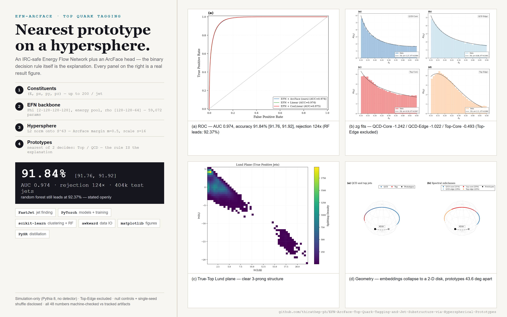

# EFN–ArcFace Top Quark Tagging and Jet Substructure via Hyperspherical Prototypes

[](https://github.com/thirathep-ph/EFN-ArcFace-Top-Quark-Tagging-and-Jet-Substructure-via-Hyperspherical-Prototypes/actions/workflows/ci.yml)
[](https://www.python.org)
[](https://opensource.org/licenses/MIT)



**[🖼️ Results Gallery](docs/RESULTS.md)**

## Intro

Top-quark vs QCD jet classification is a core LHC task where deep taggers are accurate but opaque. This project replaces the black-box head with geometry: an IRC-safe Energy Flow Network backbone plus an ArcFace prototype head, so the binary decision is exactly nearest-prototype on the unit hypersphere S^63. Unsupervised clustering on that manifold recovers jet subclasses, which are then checked against QCD predictions (splitting functions, angular scaling, Lund topology) instead of being trusted on faith.

## What was done

- **Tagger**: EFN Φ [2→128→128→128] + ρ [128→128→64], 59,072 params, ArcFace margin m=0.5, scale s=16, seed 42. Trained on 1.2M jets, tested on 404k (Top Tagging Reference Dataset).
- **Baselines**: EFN+Linear and EFN+CosLinear (3 seeds each) to isolate the effect of the hypersphere vs the margin; random forest on 10 hand-crafted substructure observables.
- **Subclass discovery**: spectral clustering per predicted class (eigengap selects k=2/class → 4 subclasses: Core/Edge × Top/QCD), with null controls (noise jets, untrained encoder) and a label-shuffled retraining control.
- **Validation battery**: SoftDrop z_g power-law fits, angular collimation, Lund planes, one mass-matched bin, 3-head geometry comparison (TwoNN/PR/PCA), PySR symbolic distillation, JetNet30 out-of-distribution scan.
- **Verification**: all 48 reported numbers are tracked to artifacts in `experiments/numbers.json`.

## Results

| Model | Accuracy (404k test) | ROC AUC | Rejection@50%TPR |
|:------|:--------------------:|:-------:|:----------------:|
| EFN + ArcFace (s=16, m=0.5) | **91.84% [91.76, 91.92]** | 0.974 | **124×** |
| EFN + Linear (3-seed mean) | 91.94% ±0.01 | 0.974 | 122× |
| EFN + CosLinear (3-seed mean) | 92.00% ±0.03 | 0.975 | 132× |
| RF (10 substructure features) | 92.37% | 0.977 | 150× |

- **Subclasses**: 4 found, 3 of 4 validated against QCD; predicted-vs-truth partitions agree (ARI 0.79). Top-Edge fit is non-identifiable and excluded from physics reading.
- **Splitting exponents** (z_g fits): QCD-Core −1.24, QCD-Edge −1.02, Top-Core −0.49 — ordering matches the QCD soft-singularity hierarchy (quark and gluon tails share the 1/z_g shape, differing only by color factor).
- **Geometry**: embeddings collapse to ~2D (TwoNN 2.21, PCA 83.6+16.4); prototypes 43.6° apart.
- **Distillation**: PySR recovers tanh(m/pT) − 0.348·τ32 — the leading physics only (rejection drops 124→33, stated as-is).

## Discussion

- The random forest wins on accuracy: on this dataset, engineered features beat raw-kinematics EFN. The contribution here is the readable representation, not SOTA accuracy.
- Known limits, all stated openly: simulation-only (Pythia 8, no detector effects), binary task, narrow pT window, mass-confounded Core–Edge separation, single-seed label shuffle, exploratory p-values.

## Conclusion

A 59k-parameter tagger whose decision rule can be drawn on a hypersphere, whose latent geometry recovers known QCD structure (3 of 4 subclasses validated, 1 honestly excluded), with every number traceable to tracked artifacts. No result rests on a single p-value or an unchecked claim.

## Reproduce

```bash
python scripts/download_data.py   # 3.4 GB dataset
pip install -e .
python scripts/train_arcface.py --scale 16 --seed 42 --quick   # sanity run
```

Layout: `arcefn/` (models, data, utils, tests), `scripts/` (training, evaluation, `analysis/`), `experiments/*.json` (tracked results), `docs/` (overview figure + full results gallery).

## Citation

```bibtex
@misc{phiankham2026efnarcface,
  author = {Thirathep N. Phiankham},
  title = {EFN--ArcFace Top Quark Tagging and Jet Substructure via Hyperspherical Prototypes},
  year = {2026},
  howpublished = {\url{https://github.com/thirathep-ph/EFN-ArcFace-Top-Quark-Tagging-and-Jet-Substructure-via-Hyperspherical-Prototypes}},
  note = {GitHub research project}
}
```

## License

MIT
